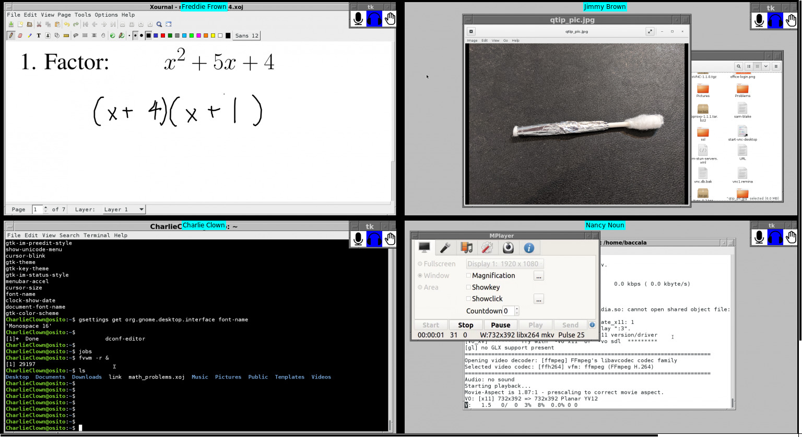

This is a pip-installable Python module to facilitate a virtual
classroom based on [Big Blue Button](https://bigbluebutton.org/) and
VNC remote desktops.

I've developed an extension to the Big Blue Button video conferencing
system that allows VNC remote desktops to be shared in a video
conference, much like a screenshare.  This extension is housed
in the [BrentBaccala/bigbluebutton](https://github.com/BrentBaccala/bigbluebutton) repository.

Once the VNC extension is installed, the Python package in this
repository allows different VNC desktops to be presented to different
participants, based on a dispatch table contained in a Postgres SQL
database.  There is also a "teacher mode" that allows moderators to
observe all student desktops running in a Big Blue Button session and
interact with them individually.  When a student's desktop is selected
(by clicking on it), that student desktop becomes full screen on the
teacher desktop, and the session audio is undeafed for that student
only.  Pressing an escape sequence (ALT-SHIFT-Q) returns the teacher
to the overview mode, and re-deafs the student.

Here's a screenshot of "teacher mode" with four students connected:

For more information, see the [Wiki](./wiki), in particular the
[installation instructions](wiki/Install).
