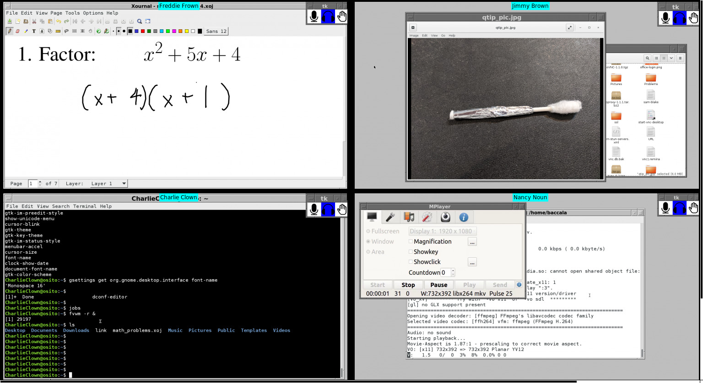

This is an extension to the
[Big Blue Button](https://bigbluebutton.org/) video conferencing
system to facilitate virtual classrooms by allowing VNC remote
desktops to be shared in a video conference.

**WARNING**: There is no real security isolation between the remote
desktops.  Anybody with access to one desktop can access all desktops.
The system is suitable for limited use but is not fully production-ready.

## Architecture

The remote desktop feature is provided by two components:

- **[bbb-plugin-remote-desktop](https://github.com/BrentBaccala/bbb-plugin-remote-desktop)** — A BigBlueButton 3.0 plugin that provides the browser-side UI using noVNC. This is a separate repository.

- **This repository (collaborate)** — Server-side VNC infrastructure packages that manage VNC desktops, authentication, and WebSocket proxying.

### Server-Side Packages

| Package | Description |
|---------|-------------|
| **bbb-vnc-collaborate** | VNC remote desktop service: websockify proxy, per-user TigerVNC servers, nginx config |
| **python3-vnc-collaborate** | Python module with VNC collaboration logic (teacher desktop, student desktop, etc.) |
| **python3-bigbluebutton** | Python library wrapping the BBB REST API |
| **bbb-auth-jwt** | JWT-based authentication service with `bbb-mklogin` CLI for generating login URLs |
| **freesoft-gnome-desktop** | GNOME desktop configuration for VNC environments (disables screen lock, setup wizard, etc.) |
| **bbb-wss-proxy** | WebSocket proxy service |

## Teacher Mode

The extension allows different VNC desktops to be presented to different
participants, each of whom is given a Linux login on the video
conferencing server.

**For security purposes, it's probably best to
think about this extension as a login method that allows UNIX users
to collaborate among themselves in video conferences.**

There is also a "teacher mode" that allows moderators to
observe all student desktops running in a Big Blue Button session and
interact with them individually.  When a student's desktop is selected
(by clicking on it), that student desktop becomes full screen on the
teacher desktop, and the session audio is undeafed for that student
only.  Pressing an escape sequence (ALT-SHIFT-Q) returns the teacher
to the overview mode, and re-deafs the student.

Here's a screenshot of "teacher mode" with four students connected:

A more basic use of this software is to share a VNC remote desktop
among the participants in a video conference.

## Installation

For installation instructions, see the [Wiki](../../wiki), in particular the
[installation instructions](../../wiki/Install).

## License

Collaborate is covered under an [open patent license](../../wiki/Patent).
