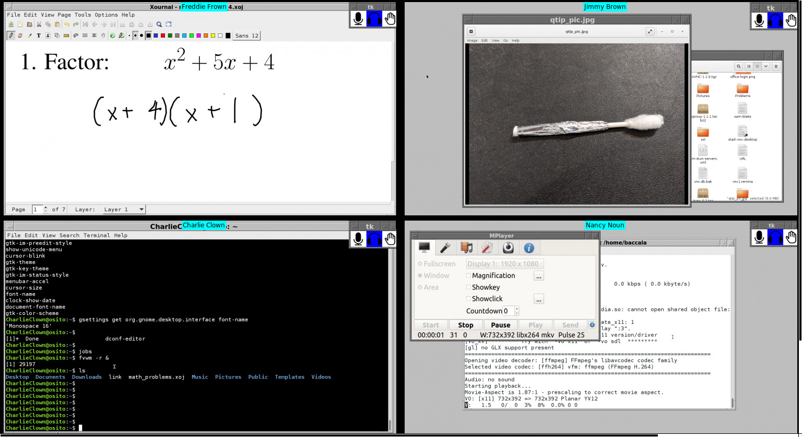

This is an extension to the
[Big Blue Button](https://bigbluebutton.org/) video conferencing
system to facilitate virtual classrooms by allowing VNC remote
desktops to be shared in a video conference.

**WARNING**: There is no real security isolation between the remote
desktops.  Anybody with access to one desktop can access all desktops.
The system is suitable for limited use but is not fully production-ready.

## Architecture

The remote desktop feature is provided by two components:

- **[bbb-plugin-remote-desktop](https://github.com/BrentBaccala/bbb-plugin-remote-desktop)** — A BigBlueButton 3.0 plugin that provides the browser-side UI using noVNC. This is a separate repository.

- **This repository (collaborate)** — Server-side VNC infrastructure packages that manage VNC desktops, authentication, and WebSocket proxying.

### Server-Side Packages

| Package | Description |
|---------|-------------|
| **bbb-vnc-collaborate** | VNC remote desktop service: websockify proxy, per-user TigerVNC servers, nginx config |
| **python3-vnc-collaborate** | Python module with VNC collaboration logic (teacher desktop, student desktop, etc.) |
| **python3-bigbluebutton** | Python library wrapping the BBB REST API |
| **bbb-auth-jwt** | JWT-based authentication service with `bbb-mklogin` CLI for generating login URLs |
| **freesoft-gnome-desktop** | GNOME desktop configuration for VNC environments (disables screen lock, setup wizard, etc.) |
| **bbb-wss-proxy** | WebSocket proxy service |

### Starting a desktop without the user logging in

Desktops normally spawn on demand, when the user connects. For the cases where
nobody will connect first — pre-warming a desktop before class, or pinning one
that is really a shim to somewhere else (an `~/.xsession` that reconnects to a
Windows host, say) — **bbb-vnc-collaborate** ships a `grid-desktop@` template
unit:

```bash
systemctl start        grid-desktop@alice   # this boot only
systemctl enable --now grid-desktop@alice   # and on every boot
```

The unit is installed but **not enabled**; nothing runs until an administrator
instantiates it for a specific user. It runs whatever that user's `~/.xsession`
runs, exactly as an on-demand spawn would.

Stopping it is deliberately non-destructive: `systemctl stop` leaves the desktop
running (there is no safe automatic teardown of a live desktop — see the
comments in the unit), and a later `start` re-adopts it rather than spawning a
duplicate. To actually tear a desktop down: `loginctl terminate-user <user>`.

This is also the **remote end of a cross-server tunnel**. The `vnc-tunnel`
package forwards a remote `/run/vnc/<user>` into a BBB host's
`/run/vnc/<user>@<host>` over SSH, so a desktop on another machine appears as a
cell in the teacher grid; `grid-desktop@<user>` is what brings that desktop up
on the far end. Such a host needs `bbb-vnc-collaborate` but not the rest of BBB,
and the remote user needs `loginctl enable-linger`, or the desktop dies a few
minutes after the tunnel disconnects. (This role was previously filled by a
standalone `vnc-desktop` package, retired 2026-07-21.)

## Teacher Mode

The extension allows different VNC desktops to be presented to different
participants, each of whom is given a Linux login on the video
conferencing server.

**For security purposes, it's probably best to
think about this extension as a login method that allows UNIX users
to collaborate among themselves in video conferences.**

There is also a "teacher mode" that allows moderators to
observe all student desktops running in a Big Blue Button session and
interact with them individually.  When a student's desktop is selected
(by clicking on it), that student desktop becomes full screen on the
teacher desktop, and the session audio is undeafed for that student
only.  Clicking the grid button returns the teacher
to the overview mode, and re-deafs the student.

Here's a screenshot of "teacher mode" with four students connected:



A more basic use of this software is to share a VNC remote desktop
among the participants in a video conference.

## Installation

For installation instructions, see the [Wiki](../../wiki), in particular the
[installation instructions](../../wiki/Install).

## License

Collaborate is covered under an [open patent license](../../wiki/Patent).
